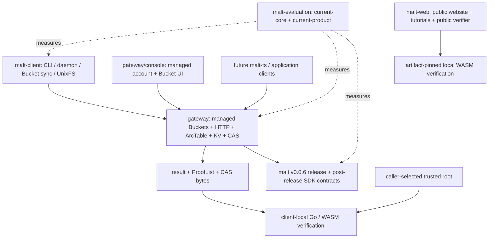

# DeWebProtocol

**User-owned, verifiable data infrastructure for the AI era.**

DeWebProtocol builds infrastructure for Personal Online Datastores: data stores
that users can hold, move, verify, and authorize across applications and storage
providers. Our goal is an open data layer where applications can use
user-controlled objects without making one platform database the permanent
authority for data integrity or structure.

## MALT

MALT is a general, arc-granularity graph data-authentication system and an
alternative to implicit Merkle-DAG authentication for evolving application
data. The current experimental core release is
[`v0.0.6`](https://github.com/DeWebProtocol/malt/releases/tag/v0.0.6).
Post-release `main` adds a language-neutral Resolve/Read conformance corpus and
a complete-view client-root writer contract; these changes are not yet a
v0.0.7 release.

MALT separates three concerns:

- immutable payload bytes remain in content-addressed storage (CAS);
- typed arcs are authenticated by vector-commitment backends; and
- ArcTable, KV, CAS, gateways, caches, and proof generation stay outside the
  client's correctness trust boundary.

Clients select a trusted root, send canonical segment arrays or typed queries,
receive `result + ProofList`, and verify locally. A resolver may return any
valid complete derivation; verification intentionally does not claim that the
path was longest or unique.

MALT is not a blockchain and its Core is not tied to one storage provider. The
current Gateway ships embedded/filesystem storage and an optional Kubo/IPFS
adapter. Filecoin and S3 remain integration targets rather than claims about
the current production surface.

## Current Architecture



### Core SDK

[`DeWebProtocol/malt`](https://github.com/DeWebProtocol/malt) owns canonical
graph/root/CID values, resolve/read/mutation contracts and schemas, commitment
backends, map/list algorithms, ProofLists, generic execution composition, and
local Go/WASM verification.

v0.0.6 makes it SDK-only. Core has no HTTP server, CLI, daemon, persistent
ArcTable/KV/CAS implementation, UnixFS application, or evaluator. Algorithms
consume narrow injected ArcSet lookup/update/snapshot capabilities instead of
defining how an ArcTable is stored. Post-release `main` also owns canonical
`UpdateView`, `SemanticIntent`, `ClientRootBundle`, and
`MaterializationReceipt` values plus the SDK writer that verifies complete
consumed state and computes one candidate root.

### Gateway

[`DeWebProtocol/gateway`](https://github.com/DeWebProtocol/gateway) embeds the
untrusted core executor and owns persistent ArcTable/KV/CAS, generic
resolve/read/root/mutation/CAS routes, HTTP policy, and managed-service
integration. Its runtime now composes separate native MALT, CAS, and Merkle DAG
compatibility profiles per scope. Named-root publication is separate policy
metadata and never replaces caller-selected roots or client-local verification.

The managed single-node Alpha now includes tenants, principals, one-time API
credentials, browser accounts, password-backed server sessions, discoverable
Passkeys, tier entitlements, and persistent logical CAS/metadata quota
reservations. Its ACL-protected Buckets have immutable versions and mutable
refs. Every personal or shared Bucket uses the same concurrent fast-forward,
conservative map-merge, and conflict-branch machinery; sharing is an ACL
difference, not a different write algorithm. A Bucket head is an observed
synchronization ref, not an automatically trusted or published root.

`gateway/console` is the same-origin managed account and Bucket UI. Gateway also
contains the evaluation-grade exact client-root replay/materialization boundary,
explicit `init` and legacy-state migration commands, independently packaged
Gateway and Console artifacts, and a one-command PM2/OpenResty single-node
deployment path.

The Alpha boundary is still explicit: browser account, session, provisioning,
Passkey-challenge, quota-reservation, and control-plane compare-and-swap safety
assume one Gateway process over one Badger database. Distributed anti-abuse and
transactional multi-process control-plane coordination, password reset and
account recovery, email verification/SMTP delivery, ambiguous-reservation
reconciliation, adversarial work budgets, and broader production hardening
remain open.

### Native client

[`DeWebProtocol/malt-client`](https://github.com/DeWebProtocol/malt-client) is
the public trusted CLI and local daemon application. It owns accepted/candidate
root policy, gateway transport, UnixFS paths/manifests/materialization, local
ProofList verification, and payload-byte binding. It also provides
IPFS-compatible Merkle DAG UnixFS import as a distinct compatibility target.
That path returns a DAG CID, not a MALT root or ProofList. The client currently
pins an exact post-v0.0.6 Core revision and intentionally has no release tag
yet. Its merged boundary split separates untrusted transport, accepted-root
policy, UnixFS behavior, and Merkle DAG compatibility into independently
reviewable packages.

The client now also owns durable managed-Bucket synchronization state. It
stages the exact candidate and original base before fetching a newer remote
head, preserves that stash across retries, and keeps Bucket synchronization
separate from accepted-root policy. It accepts HTTP 409 as a preserved branch
only when the response explicitly carries `status: "branched"`.

### Evaluation

[`DeWebProtocol/malt-evaluation`](https://github.com/DeWebProtocol/malt-evaluation)
owns reproducible workloads, plans, adapters, schemas, and result provenance.
`current-core` measures the application-neutral SDK directly over its reference
in-memory materializer; `current-product` measures the deployed Gateway and
trusted-client boundary. These are different evidence scopes and must not be
combined or relabeled.

The executable paper Section 5 RQ1-RQ4 suites and fail-closed report pipeline
are implemented. The checked-in Section 5 plan is still at
`stage=implementation` with an unfrozen revision lock, so campaign runners
reject publication dispatch. No checked-in file is a paper result.

### Public website and verifiers

[`DeWebProtocol/malt-web`](https://github.com/DeWebProtocol/malt-web) owns the
public website, conceptual documentation, tutorials, and public verification
tool. It is not the managed account or Bucket App; that product UI lives in
`gateway/console`.

A browser verifier's actual compatibility is determined by the bundled WASM
artifact and the Core source commit recorded in its `PROVENANCE.json`, together
with the artifact checksum. Neither the current Core branch nor Gateway's
`go.mod` changes an already-built verifier. The public website verifier is
rebuilt deliberately from an exact reviewed Core commit; the managed Console
packages a separate verifier and enforces alignment with Gateway's exact Core
pin during release builds.

## Operations and Trust

```text
Resolve(root, segments) -> target + ProofList
Read(root, typedQuery) -> result + ProofList
ApplyMutation(baseRoot, semanticMutation) -> candidateRoot + receipt
ComputeClientRoot(verifiedUpdateView, semanticIntent) -> candidateRoot + bundle
PushBucket(stashedBase, candidateRoot) -> fast_forward | merged | branched
```

Resolve and read are locally verifiable. MALT v0.0.6 does not claim a
delta/state-transition proof. The post-release client-root writer lets a
trusted client verify complete consumed state and compute the candidate before
submission, while Gateway defensively replays and materializes that exact
bundle. Neither a mutation receipt nor a client-root materialization receipt is
a portable transition proof, freshness proof, publication proof, or automatic
trust promotion.

Root freshness, rollback prevention, multi-writer arbitration, tenant policy,
quota, pinning, garbage collection, and production deployment remain outside
the core authentication semantics. Managed Buckets provide product-level
multi-writer synchronization, but their refs remain untrusted Gateway
observations. Clients persist candidate/base state before pulling a newer head;
`base_revision` is diagnostic metadata rather than a client-selected CAS token.

## UnixFS and Future Applications

UnixFS is one client application over generic map/list/CAS composition, not a
core layout. `/` parsing, manifests, file chunk/range behavior, and
materialization strategy belong to clients. The native client currently
exposes one `hybrid` MALT layout: each directory is an authenticated map root
while ancestor maps retain descendant root-relative path bindings. Pure `flat`
and `hierarchical` remain possible future strategies rather than current CLI
values.

Future TypeScript object support will follow the same rule: `malt-ts` will map
JavaScript/TypeScript application objects into segment arrays and semantic
operations while reusing core schemas and verification semantics.

## Repositories

| Repository | Role | Status |
|---|---|---|
| [`malt`](https://github.com/DeWebProtocol/malt) | SDK-only authentication core, normative contracts, schemas, MIPs, verifier | Experimental `v0.0.6`; post-release conformance and client-root contracts on `main` |
| [`gateway`](https://github.com/DeWebProtocol/gateway) | ArcTable/KV/CAS materialization, generic HTTP, managed accounts/Buckets, same-origin Console, product E2E | Sessions, Passkeys, tiers, quota enforcement, explicit initialization/migration, and single-node deployment on `main` |
| [`malt-client`](https://github.com/DeWebProtocol/malt-client) | Trusted native CLI/daemon, Bucket sync, MALT-authenticated UnixFS, Merkle DAG import | No tag; stash-before-pull sync and evaluation client-root workers on `main` |
| [`malt-evaluation`](https://github.com/DeWebProtocol/malt-evaluation) | Current-core/current-product workloads, executable paper suites, plans, schemas, and result provenance | Section 5 RQ1-RQ4 infrastructure implemented; campaign plan intentionally unfrozen and no paper results checked in |
| [`malt-web`](https://github.com/DeWebProtocol/malt-web) | Public website, tutorials, conceptual docs, and public verifier | Public site and commit-provenanced verifier; managed Console/Bucket UI lives in `gateway/console` |

## Status

MALT remains experimental, pre-v1, and unaudited. APIs may change. The current
validated path includes core test/vet/build, gateway and client test/vet/build,
Gateway Console and public-site tests/builds, artifact-pinned WASM provenance,
and pinned-client CAS -> gateway -> trusted-client Product E2E coverage.

The repository-boundary migration, Resolve/Read conformance corpus, managed
Bucket synchronization, complete-view client-root contract, and executable
Section 5 RQ1-RQ4 paper-evaluation infrastructure are merged. MALT remains
experimental: publication-quality paper campaigns are still unfrozen, the
ordinary native write UX is not yet generally migrated to client-root
computation, and multi-instance Gateway control-plane safety, full resource
governance and production hardening, client packaging, an independent
transition-proof contract, and a future TypeScript client remain open.

## Documentation

- Normative protocol, schema, proof, CID, compatibility, and MIP documentation:
  [`malt/docs`](https://github.com/DeWebProtocol/malt/tree/main/docs)
- Gateway service behavior: [`gateway`](https://github.com/DeWebProtocol/gateway)
- Native client, Bucket synchronization, trusted roots, and UnixFS:
  [`malt-client`](https://github.com/DeWebProtocol/malt-client)
- Reproducible workloads, Section 5 suites, plans, schemas, and result
  provenance:
  [`malt-evaluation`](https://github.com/DeWebProtocol/malt-evaluation)
- Public explanation and tutorials: [`malt-web`](https://github.com/DeWebProtocol/malt-web)

Security issues should not be reported through public issues. See
[SECURITY.md](https://github.com/DeWebProtocol/.github/blob/main/SECURITY.md)
for reporting guidance.
