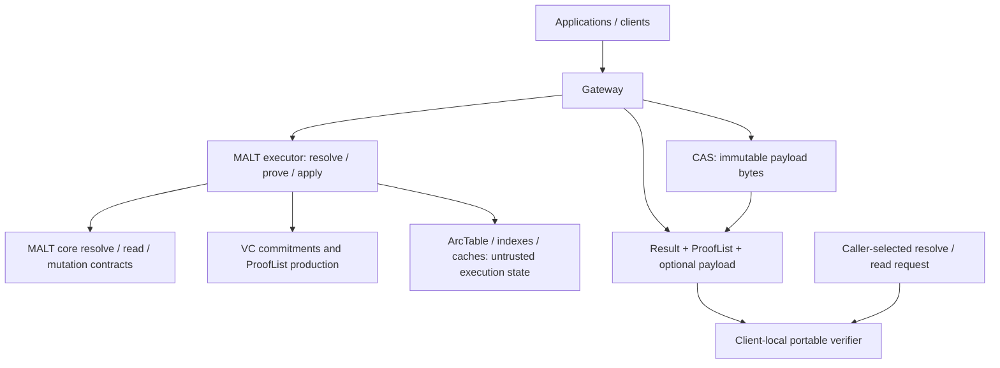
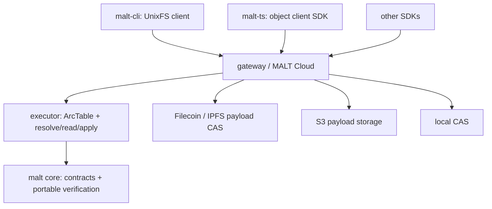

# DeWebProtocol

**User-owned data infrastructure for the AI era.**

DeWebProtocol builds infrastructure for Personal Online Datastores: data stores
that users can hold, move, verify, and authorize across applications and storage
providers. In many cloud and AI systems today, user data lives inside
platform-controlled databases and object stores. Users can usually access it
only through platform APIs, and the structure connecting objects can disappear
when a service goes away.

Our long-term goal is an open and verifiable data layer where users own their
data, applications operate on user-controlled objects, and storage providers can
be replaced without losing data integrity or structure.

## MALT

MALT is DeWebProtocol's current core project: a general, arc-granularity graph
data-authentication system and an alternative to Merkle-DAG authentication for
mutable application data. Its experimental
[`v0.0.4`](https://github.com/DeWebProtocol/malt/releases/tag/v0.0.4) source
release packages canonical segment paths and the frozen
`malt.artifact/v0alpha2` resolve/prove compatibility profile.

MALT separates three concerns that implicit Merkle-DAG arcs couple together:

- immutable payload bytes remain in ordinary content-addressed storage (CAS);
- typed arcs are authenticated by vector-commitment (VC) backends; and
- traversal, indexing, caching, gateways, executors, and other execution/access
  state stay outside the verifier trust boundary.

Traditional content-addressed storage and Merkle DAG systems often embed object
references directly inside object content. That works well for immutable
objects, but it couples traversal, proof generation, reference updates, object
rewrites, and data layout to the same object boundary. To verify a path, a
client usually needs the linked object chain itself as proof material.

MALT keeps payloads as ordinary immutable content-addressed objects and
authenticates the mutable relationships among them using typed list/map roots
and verifier-facing proofs. Generic maps can also be relation-only: the
standard `@payload` coordinate is optional at the core level, while an
application model such as UnixFS may require it as its own invariant. Flat
`root + path` lookups
can return dedicated proof material for each semantic lookup instead of
requiring the Merkle-DAG traversal chain. Content reads can use normal HTTP(S)
response bodies and carry verification evidence in `X-Malt-ProofList`. In the
target trust model, clients verify
caller-selected resolve/read requests against untrusted results locally without
trusting gateways, storage services, caches, or materialized indexes.

Clients submit canonical segment arrays without discovering how each graph root
groups a long path into arcs. The reference resolver may prefer the longest
prefix, while verification proves one complete returned derivation without
claiming that it was unique or globally longest.

Technically, MALT encodes list and map relations as canonical cells and
authenticates them with vector-commitment-style backends, producing compact
proofs for the specific path or reference a client queried. Clients hold a
trusted MALT root and verify references and proofs returned by untrusted
infrastructure.

MALT is not a blockchain and does not depend on one storage provider. It can run
over IPFS, Filecoin, S3, local CAS implementations, or other object and
content-addressed storage backends.

**Status:** `v0.0.4` is an experimental source release. MALT is runnable end to
end, but its public APIs, ProofList schemas, wire formats, and deployment
policies may change. It is not production-ready or an audited managed service.

**Active draft:**
[`malt` PR #163](https://github.com/DeWebProtocol/malt/pull/163), current head
`db271e725dc0f4a21a7263eff92a14292c6590de`, proposes a tighter
client/gateway/core boundary. It is not merged or released. The repository's
released baseline remains v0.0.4; the package/process split and local-verifier
surfaces in the draft must not be treated as v0.0.4 APIs.

## Released v0.0.4 Baseline

The [`malt`](https://github.com/DeWebProtocol/malt) v0.0.4 release provides an
end-to-end experimental reference implementation:

- authenticated list and map semantics
- module-root typed read/apply/verify values through the combined experimental
  `Engine` facade
- an `artifact` package with the explicit
  frozen `malt.artifact/v0alpha2` resolve/prove compatibility profile and JSON Schemas
- canonical segment arrays and proof-carrying multi-arc composition
- a portable `auth/verifier` kernel that does not require ArcTable, CAS,
  runtime, application adapters, servers, or network state
- root-relative add, resolve, verify, and writer-mutation workflows
- a local runtime process and command-line client
- HTTP-native content reads with `X-Malt-ProofList` proof headers
- fixed-size proof material for flat `root + path` semantic lookups
- immutable payload storage through external CAS backends
- KZG and IPA commitment backends
- overwrite and versioned ArcTable modes
- a UnixFS application implementation under the released `layout/unixfs`
  package; `flat`/`hierarchical` name its materialization strategies
- reproducible evaluation workloads for traversal, proof overhead, storage
  overhead, and rewrite amplification

## Active Draft Target

PR #163 at head `db271e7` proposes, but has not released:

- module-root resolve/read values and `VerifyResolve`/`VerifyRead`, with portable write values in
  `mutation` and untrusted read/apply execution in `execution.Executor`
- transport-neutral `malt.resolve/v0alpha1` and `malt.read/v0alpha1`
  request/result/verification values and JSON Schemas under `protocol`
- separate UnixFS ownership under `model/unixfs`, `sdk/unixfs`, and
  `runtime/unixfs`
- an all-in-one development/conformance backend under `reference/executor`
- caller-request/untrusted-result local verification through `sdk/verifier`, a
  browser/WASM export, and a local CLI path

The gateway and public Web repositories contain integration-preview work aimed
at this draft. That preview does not promote the draft packages or verifier
contract into the released v0.0.4 baseline.

## Reference Architecture

The system design uses a reference CLI, an untrusted executor, and an evaluation
surface around the portable core. In released v0.0.4, those runtime pieces have
the older combined package/process layout. PR #163 proposes the explicit
`reference/executor` package and caller-bound local verifier. The separate
private `gateway` service owns the managed execution boundary and serves the
operation-specific resolve/read API and UnixFS product scenario used by the
public Web App.
Its `/verify` response is diagnostic only. Managed identity and production
policy remain work.
The planned standalone `malt-cli` repository will evolve the local client
surface into a filesystem-oriented client and synchronization runtime.

## Product Architecture

`gateway` is the active managed service repository. Standalone `malt-cli` and
`malt-ts` are still planned product surfaces.

## Repositories

| Repository | Role | Status |
| --- | --- | --- |
| [`malt`](https://github.com/DeWebProtocol/malt) | Core semantics, portable verifier, resolve/read schemas, frozen artifact compatibility, UnixFS application, runtime/CLI, benchmarks, and evaluation | Experimental `v0.0.4` release; PR #163 package split is an unmerged draft |
| [`malt-web`](https://github.com/DeWebProtocol/malt-web) | Public website, gateway-backed browser App, conceptual documentation, and user-facing design narrative | Active integration preview; local verifier targets unmerged PR #163 |
| [`gateway`](https://github.com/DeWebProtocol/gateway) | Private managed gateway boundary with separate executor, diagnostic resolve/read verification, and UnixFS application capabilities over the PR #163 integration pin | Runnable local product; production policy incomplete |
| `malt-cli` | Standalone filesystem client, local runtime, and synchronization bridge | Planned |
| `malt-ts` | TypeScript SDK for persistent and verifiable application objects | Planned |

Planned repositories are listed to describe the intended project structure.

## Documentation Ownership

The `malt` repository owns implementation-bound specifications, schemas, wire
formats, API behavior, test vectors, evaluation documentation, and MIPs under
`docs/mips`. `gateway` owns managed service behavior: tenants, identity,
authorization, backend orchestration, root publication, cache policy, and
deployment concerns. `malt-web` owns conceptual explanations, tutorials,
product narratives, and user-facing documentation. We do not maintain a
separate `malt-docs` repository today.

## Getting Started

- To understand the protocol, object model, proof semantics, and research
  artifact, start with [`dewebprotocol/malt`](https://github.com/DeWebProtocol/malt)
  and the [`v0.0.4` release notes](https://github.com/DeWebProtocol/malt/releases/tag/v0.0.4).
- To read the public website and documentation source, see
  [`dewebprotocol/malt-web`](https://github.com/DeWebProtocol/malt-web).
- To run or design a hosted service, start with MALT's public
  [repository boundary](https://github.com/DeWebProtocol/malt#repository-boundary).
  The managed `gateway` repository is private but now provides the working
  local resolve/read/content path used by `malt-web`.
- To synchronize local files, follow the planned `malt-cli` work.
- To define verifiable application objects in TypeScript, follow the planned
  `malt-ts` work.

## Research and Evaluation

MALT is developed as both a systems research project and an experimental
reference implementation. The core repository contains benchmarks, evaluation
workloads, and reproducibility artifacts for studying traversal latency, proof
size, and rewrite amplification in authenticated object graphs.

We avoid claiming production readiness, audit status, deployment scale, or
performance numbers unless they are backed by the current repositories.

## Contributing

Useful contribution areas include commitment backends, storage adapters, IPLD
and CID codecs, SDKs, test vectors, benchmarks, documentation, local-first
synchronization, and security review.

Before opening a pull request, check the target repository's README and local
contribution notes. Protocol, encoding, wire-format, or proof changes should
include tests and, when applicable, cross-language test vectors.

Security issues should not be reported through public issues. See
[SECURITY.md](https://github.com/DeWebProtocol/.github/blob/main/SECURITY.md)
for the current reporting guidance.
