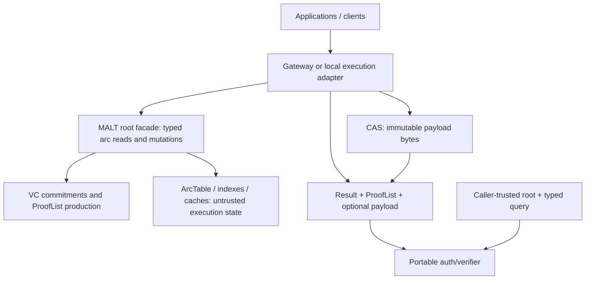
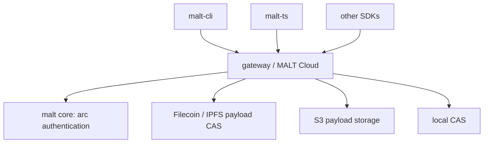

# DeWebProtocol

**User-owned data infrastructure for the AI era.**

DeWebProtocol builds infrastructure for Personal Online Datastores: data stores
that users can hold, move, verify, and authorize across applications and storage
providers. In many cloud and AI systems today, user data lives inside
platform-controlled databases and object stores. Users can usually access it
only through platform APIs, and the structure connecting objects can disappear
when a service goes away.

Our long-term goal is an open and verifiable data layer where users own their
data, applications operate on user-controlled objects, and storage providers can
be replaced without losing data integrity or structure.

## MALT

MALT is DeWebProtocol's current core project: a general, arc-granularity graph
data-authentication system and an alternative to Merkle-DAG authentication for
mutable application data. Its experimental
[`v0.0.3`](https://github.com/DeWebProtocol/malt/releases/tag/v0.0.3) source
release packages the portable authentication core for external consumers.

MALT separates three concerns that implicit Merkle-DAG arcs couple together:

- immutable payload bytes remain in ordinary content-addressed storage (CAS);
- typed arcs are authenticated by vector-commitment (VC) backends; and
- traversal, indexing, caching, gateways, and other execution/access state stay
  outside the verifier trust boundary.

Traditional content-addressed storage and Merkle DAG systems often embed object
references directly inside object content. That works well for immutable
objects, but it couples traversal, proof generation, reference updates, object
rewrites, and data layout to the same object boundary. To verify a path, a
client usually needs the linked object chain itself as proof material.

MALT keeps payloads as ordinary immutable content-addressed objects and
authenticates the mutable relationships among them using typed list/map roots
and verifier-facing proofs. Generic maps can also be relation-only: the
standard `@payload` coordinate is optional at the core level, while a layout
such as UnixFS may require it as its own invariant. Flat `root + path` lookups
can return dedicated proof material for each semantic lookup instead of
requiring the Merkle-DAG traversal chain. Content reads can use normal HTTP(S)
response bodies and carry verification evidence in `X-Malt-ProofList`, so
clients verify `trusted root + typed query -> result` without trusting
gateways, storage services, caches, or materialized indexes.

Technically, MALT encodes list and map relations as canonical cells and
authenticates them with vector-commitment-style backends, producing compact
proofs for the specific path or reference a client queried. Clients hold a
trusted MALT root and verify references and proofs returned by untrusted
infrastructure.

MALT is not a blockchain and does not depend on one storage provider. It can run
over IPFS, Filecoin, S3, local CAS implementations, or other object and
content-addressed storage backends.

**Status:** `v0.0.3` is an experimental source release. MALT is runnable end to
end, but its public APIs, ProofList schemas, wire formats, and deployment
policies may change. It is not production-ready or an audited managed service.

## What Works Today

The current [`malt`](https://github.com/DeWebProtocol/malt) repository provides
an end-to-end experimental reference implementation:

- authenticated list and map semantics
- a module-root `malt` facade for typed reads, mutations, and verification
- a portable `auth/verifier` kernel that does not require ArcTable, CAS,
  runtime, layout, server, daemon, or network state
- root-relative add, resolve, verify, and writer-mutation workflows
- a local daemon and reference command-line client
- HTTP-native content reads with `X-Malt-ProofList` proof headers
- fixed-size proof material for flat `root + path` semantic lookups
- immutable payload storage through external CAS backends
- KZG and IPA commitment backends
- overwrite and versioned ArcTable modes
- UnixFS-style application layouts as one application of the general core
- reproducible evaluation workloads for traversal, proof overhead, storage
  overhead, and rewrite amplification

## Current Reference Implementation

The current `malt` core repository includes a reference CLI, local daemon, and
evaluation gateway surface. A separate private `gateway` service skeleton owns
managed service integration and independently orchestrates MALT core and CAS.
The planned standalone `malt-cli` repository will evolve the local client
surface into a filesystem-oriented client and synchronization runtime.

## Planned Product Architecture

`gateway` is the managed service repository. Standalone `malt-cli` and
`malt-ts` are still planned product surfaces.

## Repositories

| Repository | Role | Status |
| --- | --- | --- |
| [`malt`](https://github.com/DeWebProtocol/malt) | Core semantics, portable verifier, reference implementation, CLI/daemon/eval-gateway surface, benchmarks, and evaluation | Experimental `v0.0.3` source release |
| [`malt-web`](https://github.com/DeWebProtocol/malt-web) | Public website, conceptual documentation, and user-facing design narrative | Active |
| `gateway` | Private managed MALT gateway skeleton for tenants, identity, authorization, backend orchestration, and product e2e tests | Early private service skeleton |
| `malt-cli` | Standalone filesystem client, local runtime, and synchronization bridge | Planned |
| `malt-ts` | TypeScript SDK for persistent and verifiable application objects | Planned |

Planned repositories are listed to describe the intended project structure.

## Documentation Ownership

The `malt` repository owns implementation-bound specifications, schemas, wire
formats, API behavior, test vectors, evaluation documentation, and MIPs under
`docs/mips`. `gateway` owns managed service behavior: tenants, identity,
authorization, backend orchestration, root publication, cache policy, and
deployment concerns. `malt-web` owns conceptual explanations, tutorials,
product narratives, and user-facing documentation. We do not maintain a
separate `malt-docs` repository today.

## Getting Started

- To understand the protocol, object model, proof semantics, and research
  artifact, start with [`dewebprotocol/malt`](https://github.com/DeWebProtocol/malt)
  and the [`v0.0.3` release notes](https://github.com/DeWebProtocol/malt/releases/tag/v0.0.3).
- To read the public website and documentation source, see
  [`dewebprotocol/malt-web`](https://github.com/DeWebProtocol/malt-web).
- To design a hosted service, start with MALT's public
  [repository boundary](https://github.com/DeWebProtocol/malt#repository-boundary).
  The managed `gateway` skeleton is currently private.
- To synchronize local files, follow the planned `malt-cli` work.
- To define verifiable application objects in TypeScript, follow the planned
  `malt-ts` work.

## Research and Evaluation

MALT is developed as both a systems research project and an experimental
reference implementation. The core repository contains benchmarks, evaluation
workloads, and reproducibility artifacts for studying traversal latency, proof
size, and rewrite amplification in authenticated object graphs.

We avoid claiming production readiness, audit status, deployment scale, or
performance numbers unless they are backed by the current repositories.

## Contributing

Useful contribution areas include commitment backends, storage adapters, IPLD
and CID codecs, SDKs, test vectors, benchmarks, documentation, local-first
synchronization, and security review.

Before opening a pull request, check the target repository's README and local
contribution notes. Protocol, encoding, wire-format, or proof changes should
include tests and, when applicable, cross-language test vectors.

Security issues should not be reported through public issues. See
[SECURITY.md](https://github.com/DeWebProtocol/.github/blob/main/SECURITY.md)
for the current reporting guidance.
