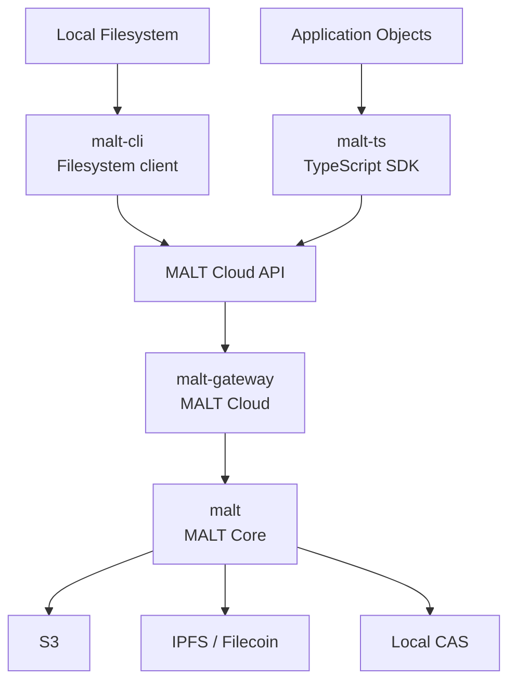

# DeWebProtocol

**User-owned data infrastructure for the AI era.**

DeWebProtocol builds infrastructure for Personal Online Datastores: data stores
that users can hold, move, verify, and authorize across applications and storage
providers. In many cloud and AI systems today, user data lives inside
platform-controlled databases and object stores. Users can usually access it
only through platform APIs, and the structure connecting objects can disappear
when a service goes away.

Our long-term goal is an open and verifiable data layer where users own their
data, applications operate on user-controlled objects, and storage providers can
be replaced without losing data integrity or structure.

## MALT

MALT, the **Mutable Arc Layer**, is DeWebProtocol's current core project. It
defines persistent object graphs whose content and authenticated relationships
can be independently stored, resolved, updated, and verified.

Traditional content-addressed storage and Merkle DAG systems often embed object
references directly inside object content. That works well for immutable
objects, but it couples traversal, proof generation, reference updates, object
rewrites, and data layout to the same object boundary.

MALT models relationships as explicit authenticated arcs. A MALT object can
contain immutable payload data, authenticated outgoing arcs, a structure
commitment, and verifiable path-to-reference mappings. Technically, MALT
encodes list and map relations as canonical cells and authenticates them with
vector-commitment-style backends, producing compact proofs for the specific path
or reference a client queried. Clients hold a trusted MALT root and verify
references and proofs returned by untrusted gateways or storage services.

MALT is not a blockchain and does not depend on one storage provider. It can run
over IPFS, Filecoin, S3, local CAS implementations, or other object and
content-addressed storage backends.

**Status:** MALT is an experimental reference implementation. It is runnable end
to end, but its public APIs, ProofList schemas, wire formats, and deployment
policies may change. It is not production-ready.

## Architecture

`malt-cli` and `malt-ts` are peer clients. Both are intended to produce,
upload, retrieve, and verify MALT data. `malt-gateway` is the planned hosted
MALT Cloud backend. `malt` is the protocol and reference implementation that
defines the shared semantics used by clients and services.

## Repositories

| Repository | Role | Status |
| --- | --- | --- |
| [`malt`](https://github.com/DeWebProtocol/malt) | Core protocol, reference implementation, benchmarks, and evaluation | Active |
| [`malt-web`](https://github.com/DeWebProtocol/malt-web) | Public website and documentation site | Active |
| `malt-gateway` | Multi-tenant MALT Cloud backend for storing, resolving, and serving MALT objects | Planned |
| `malt-cli` | Filesystem-oriented MALT client, local daemon, and synchronization runtime | Planned |
| `malt-ts` | TypeScript SDK for persistent and verifiable application objects | Planned |

The planned repositories are listed to describe the intended project structure.
They are not linked until public repositories exist.

## Getting Started

- To understand the protocol, object model, proof semantics, and research
  artifact, start with [`dewebprotocol/malt`](https://github.com/DeWebProtocol/malt).
- To read the public website and documentation source, see
  [`dewebprotocol/malt-web`](https://github.com/DeWebProtocol/malt-web).
- To build a hosted service, follow the planned `malt-gateway` work.
- To synchronize local files, follow the planned `malt-cli` work.
- To define verifiable application objects in TypeScript, follow the planned
  `malt-ts` work.

## Research and Evaluation

MALT is developed as both a systems research project and an experimental
reference implementation. The core repository contains benchmarks, evaluation
workloads, and reproducibility artifacts for studying traversal latency, proof
size, and rewrite amplification in authenticated object graphs.

We avoid claiming production readiness, audit status, deployment scale, or
performance numbers unless they are backed by the current repositories.

## Contributing

Useful contribution areas include commitment backends, storage adapters, IPLD
and CID codecs, SDKs, test vectors, benchmarks, documentation, local-first
synchronization, and security review.

Before opening a pull request, check the target repository's README and local
contribution notes. Protocol, encoding, wire-format, or proof changes should
include tests and, when applicable, cross-language test vectors.

Security issues should not be reported through public issues. See
[SECURITY.md](https://github.com/DeWebProtocol/.github/blob/main/SECURITY.md)
for the current reporting guidance.
