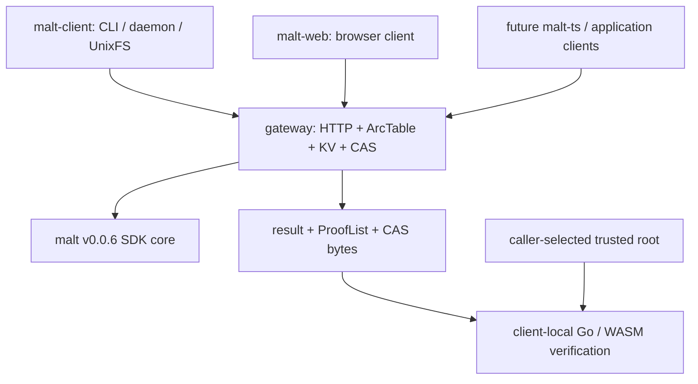

# DeWebProtocol

**User-owned, verifiable data infrastructure for the AI era.**

DeWebProtocol builds infrastructure for Personal Online Datastores: data stores
that users can hold, move, verify, and authorize across applications and storage
providers. Our goal is an open data layer where applications can use
user-controlled objects without making one platform database the permanent
authority for data integrity or structure.

## MALT

MALT is a general, arc-granularity graph data-authentication system and an
alternative to implicit Merkle-DAG authentication for evolving application
data. The current experimental core release is
[`v0.0.6`](https://github.com/DeWebProtocol/malt/releases/tag/v0.0.6).

MALT separates three concerns:

- immutable payload bytes remain in content-addressed storage (CAS);
- typed arcs are authenticated by vector-commitment backends; and
- ArcTable, KV, CAS, gateways, caches, and proof generation stay outside the
  client's correctness trust boundary.

Clients select a trusted root, send canonical segment arrays or typed queries,
receive `result + ProofList`, and verify locally. A resolver may return any
valid complete derivation; verification intentionally does not claim that the
path was longest or unique.

MALT is not a blockchain and is not tied to one storage provider. Payloads can
live over Filecoin/IPFS, S3, local CAS, or other immutable storage backends.

## Current Architecture



### Core SDK

[`DeWebProtocol/malt`](https://github.com/DeWebProtocol/malt) owns canonical
graph/root/CID values, resolve/read/mutation contracts and schemas, commitment
backends, map/list algorithms, ProofLists, generic execution composition, and
local Go/WASM verification.

v0.0.6 makes it SDK-only. Core has no HTTP server, CLI, daemon, persistent
ArcTable/KV/CAS implementation, UnixFS application, or evaluator. Algorithms
consume a narrow injected ArcSet materializer capability instead of defining
how an ArcTable is stored.

### Gateway

[`DeWebProtocol/gateway`](https://github.com/DeWebProtocol/gateway) embeds the
untrusted core executor and owns persistent ArcTable/KV/CAS, generic
resolve/read/root/mutation/CAS routes, HTTP policy, and future managed-service
integrations. Diagnostic `/verify` endpoints never replace client-local
verification.

### Native client

[`DeWebProtocol/malt-client`](https://github.com/DeWebProtocol/malt-client) is
the public trusted CLI and local daemon application. It owns accepted/candidate
root policy, gateway transport, UnixFS paths/manifests/materialization, local
ProofList verification, and payload-byte binding. It currently tracks core
v0.0.6 and intentionally has no release tag yet.

### Browser client

[`DeWebProtocol/malt-web`](https://github.com/DeWebProtocol/malt-web) is the
browser client, public website, and explanatory documentation. It uses generic
gateway resolve/read/CAS operations and verifies with a WASM build whose
provenance is pinned to the v0.0.6 release commit.

## Operations and Trust

```text
Resolve(root, segments) -> target + ProofList
Read(root, typedQuery) -> result + ProofList
ApplyMutation(baseRoot, semanticMutation) -> candidateRoot + receipt
```

Resolve and read are locally verifiable. MALT v0.0.6 does not claim a
delta/state-transition proof: a gateway-produced root remains a candidate until
the user explicitly accepts it or an independent publication policy establishes
trust.

Root freshness, rollback prevention, multi-writer arbitration, tenant policy,
quota, pinning, garbage collection, and production deployment remain outside
the core authentication semantics.

## UnixFS and Future Applications

UnixFS is one client application over generic map/list/CAS composition, not a
core layout. `/` parsing, manifests, file chunk/range behavior, and
`flat`/`hierarchical` materialization strategies belong to clients.

Future TypeScript object support will follow the same rule: `malt-ts` will map
JavaScript/TypeScript application objects into segment arrays and semantic
operations while reusing core schemas and verification semantics.

## Repositories

| Repository | Role | Status |
|---|---|---|
| [`malt`](https://github.com/DeWebProtocol/malt) | SDK-only authentication core, normative contracts, schemas, MIPs, verifier | Experimental `v0.0.6` |
| [`gateway`](https://github.com/DeWebProtocol/gateway) | ArcTable/KV/CAS materialization, generic HTTP service, managed-service boundary | Pins v0.0.6; product hardening ongoing |
| [`malt-client`](https://github.com/DeWebProtocol/malt-client) | Trusted native CLI/daemon and UnixFS client | Public initial implementation; no tag yet |
| [`malt-web`](https://github.com/DeWebProtocol/malt-web) | Browser client, public website, tutorials, conceptual docs | v0.0.6 generic gateway/WASM integration |

## Status

MALT remains experimental, pre-v1, and unaudited. APIs may change. The current
validated path includes core test/vet/build, gateway and client test/vet/build,
browser tests/build, local WASM provenance, and a local
CAS -> gateway -> trusted-client candidate/accept/resolve smoke.

Next priorities are language-neutral conformance vectors, a maintained product
E2E suite, mutation transition semantics, native client packaging, a future
TypeScript client, and paper-grade evaluation outside SDK core.

## Documentation

- Normative protocol, schema, proof, CID, compatibility, and MIP documentation:
  [`malt/docs`](https://github.com/DeWebProtocol/malt/tree/main/docs)
- Gateway service behavior: [`gateway`](https://github.com/DeWebProtocol/gateway)
- Public explanation and tutorials: [`malt-web`](https://github.com/DeWebProtocol/malt-web)

Security issues should not be reported through public issues. See
[SECURITY.md](https://github.com/DeWebProtocol/.github/blob/main/SECURITY.md)
for reporting guidance.
