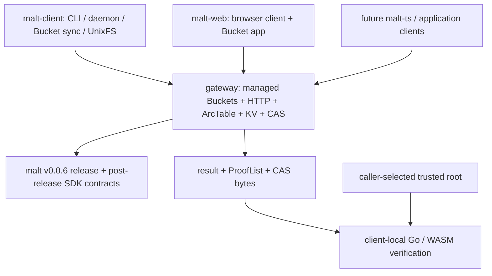

# DeWebProtocol

**User-owned, verifiable data infrastructure for the AI era.**

DeWebProtocol builds infrastructure for Personal Online Datastores: data stores
that users can hold, move, verify, and authorize across applications and storage
providers. Our goal is an open data layer where applications can use
user-controlled objects without making one platform database the permanent
authority for data integrity or structure.

## MALT

MALT is a general, arc-granularity graph data-authentication system and an
alternative to implicit Merkle-DAG authentication for evolving application
data. The current experimental core release is
[`v0.0.6`](https://github.com/DeWebProtocol/malt/releases/tag/v0.0.6).
Post-release `main` adds a language-neutral Resolve/Read conformance corpus and
a complete-view client-root writer contract; these changes are not yet a
v0.0.7 release.

MALT separates three concerns:

- immutable payload bytes remain in content-addressed storage (CAS);
- typed arcs are authenticated by vector-commitment backends; and
- ArcTable, KV, CAS, gateways, caches, and proof generation stay outside the
  client's correctness trust boundary.

Clients select a trusted root, send canonical segment arrays or typed queries,
receive `result + ProofList`, and verify locally. A resolver may return any
valid complete derivation; verification intentionally does not claim that the
path was longest or unique.

MALT is not a blockchain and is not tied to one storage provider. Payloads can
live over Filecoin/IPFS, S3, local CAS, or other immutable storage backends.

## Current Architecture



### Core SDK

[`DeWebProtocol/malt`](https://github.com/DeWebProtocol/malt) owns canonical
graph/root/CID values, resolve/read/mutation contracts and schemas, commitment
backends, map/list algorithms, ProofLists, generic execution composition, and
local Go/WASM verification.

v0.0.6 makes it SDK-only. Core has no HTTP server, CLI, daemon, persistent
ArcTable/KV/CAS implementation, UnixFS application, or evaluator. Algorithms
consume narrow injected ArcSet lookup/update/snapshot capabilities instead of
defining how an ArcTable is stored. Post-release `main` also owns canonical
`UpdateView`, `SemanticIntent`, `ClientRootBundle`, and
`MaterializationReceipt` values plus the SDK writer that verifies complete
consumed state and computes one candidate root.

### Gateway

[`DeWebProtocol/gateway`](https://github.com/DeWebProtocol/gateway) embeds the
untrusted core executor and owns persistent ArcTable/KV/CAS, generic
resolve/read/root/mutation/CAS routes, HTTP policy, and managed-service
integration. Its runtime now composes separate native MALT, CAS, and Merkle DAG
compatibility profiles per scope. Named-root publication is separate policy
metadata and never replaces caller-selected roots or client-local verification.

The managed service now includes tenants, principals, one-time API credentials,
and ACL-protected Buckets with immutable versions and mutable refs. Every
personal or shared Bucket uses the same concurrent fast-forward, conservative
map-merge, and conflict-branch machinery; sharing is an ACL difference, not a
different write algorithm. A Bucket head is an observed synchronization ref,
not an automatically trusted or published root.

Gateway also contains the evaluation-grade exact client-root replay and
materialization boundary plus a single-instance PM2/OpenResty alpha deployment
kit. Multi-process control-plane compare-and-swap, quotas, adversarial work
budgets, and broader production hardening remain open.

### Native client

[`DeWebProtocol/malt-client`](https://github.com/DeWebProtocol/malt-client) is
the public trusted CLI and local daemon application. It owns accepted/candidate
root policy, gateway transport, UnixFS paths/manifests/materialization, local
ProofList verification, and payload-byte binding. It also provides
IPFS-compatible Merkle DAG UnixFS import as a distinct compatibility target.
That path returns a DAG CID, not a MALT root or ProofList. The client currently
tracks core v0.0.6 and intentionally has no release tag yet. Its merged boundary
split separates untrusted transport, accepted-root policy, UnixFS behavior, and
Merkle DAG compatibility into independently reviewable packages.

The client now also owns durable managed-Bucket synchronization state. It
stages the exact candidate and original base before fetching a newer remote
head, preserves that stash across retries, and keeps Bucket synchronization
separate from accepted-root policy. It accepts HTTP 409 as a preserved branch
only when the response explicitly carries `status: "branched"`.

### Browser client

[`DeWebProtocol/malt-web`](https://github.com/DeWebProtocol/malt-web) is the
browser client, public website, and explanatory documentation. It uses generic
gateway resolve/read/CAS operations and verifies with a WASM build whose
provenance is pinned to the v0.0.6 release commit.

The App can connect to authenticated managed Buckets and keeps independent
Gateway/profile/Bucket-scoped local stashes before a push. Observed Bucket
heads remain untrusted until explicitly selected by the user.

## Operations and Trust

```text
Resolve(root, segments) -> target + ProofList
Read(root, typedQuery) -> result + ProofList
ApplyMutation(baseRoot, semanticMutation) -> candidateRoot + receipt
ComputeClientRoot(verifiedUpdateView, semanticIntent) -> candidateRoot + bundle
PushBucket(stashedBase, candidateRoot) -> fast_forward | merged | branched
```

Resolve and read are locally verifiable. MALT v0.0.6 does not claim a
delta/state-transition proof. The post-release client-root writer lets a
trusted client verify complete consumed state and compute the candidate before
submission, while Gateway defensively replays and materializes that exact
bundle. Neither a mutation receipt nor a client-root materialization receipt is
a portable transition proof, freshness proof, publication proof, or automatic
trust promotion.

Root freshness, rollback prevention, multi-writer arbitration, tenant policy,
quota, pinning, garbage collection, and production deployment remain outside
the core authentication semantics. Managed Buckets provide product-level
multi-writer synchronization, but their refs remain untrusted Gateway
observations. Clients persist candidate/base state before pulling a newer head;
`base_revision` is diagnostic metadata rather than a client-selected CAS token.

## UnixFS and Future Applications

UnixFS is one client application over generic map/list/CAS composition, not a
core layout. `/` parsing, manifests, file chunk/range behavior, and
materialization strategy belong to clients. The native client currently
exposes one `hybrid` MALT layout: each directory is an authenticated map root
while ancestor maps retain descendant root-relative path bindings. Pure `flat`
and `hierarchical` remain possible future strategies rather than current CLI
values.

Future TypeScript object support will follow the same rule: `malt-ts` will map
JavaScript/TypeScript application objects into segment arrays and semantic
operations while reusing core schemas and verification semantics.

## Repositories

| Repository | Role | Status |
|---|---|---|
| [`malt`](https://github.com/DeWebProtocol/malt) | SDK-only authentication core, normative contracts, schemas, MIPs, verifier | Experimental `v0.0.6`; post-release conformance and client-root contracts on `main` |
| [`gateway`](https://github.com/DeWebProtocol/gateway) | ArcTable/KV/CAS materialization, generic HTTP, managed tenants/Buckets, product E2E | Bucket synchronization, paper-evaluation runtime, and alpha deployment kit on `main` |
| [`malt-client`](https://github.com/DeWebProtocol/malt-client) | Trusted native CLI/daemon, Bucket sync, MALT-authenticated UnixFS, Merkle DAG import | No tag; stash-before-pull sync and evaluation client-root workers on `main` |
| [`malt-web`](https://github.com/DeWebProtocol/malt-web) | Browser client, public website, tutorials, conceptual docs | Managed-Bucket App and hardened browser stashes on `main` |

## Status

MALT remains experimental, pre-v1, and unaudited. APIs may change. The current
validated path includes core test/vet/build, gateway and client test/vet/build,
browser tests/build, local WASM provenance, and pinned-client
CAS -> gateway -> trusted-client Product E2E coverage.

The repository-boundary migration, Resolve/Read conformance corpus, managed
Bucket synchronization, complete-view client-root contract, and executable
paper-evaluation infrastructure are merged. MALT remains experimental:
publication-quality paper campaigns are still unfrozen, the ordinary native
write UX is not yet generally migrated to client-root computation, and
multi-instance Gateway control-plane safety, resource governance, client
packaging, an independent transition-proof contract, and a future TypeScript
client remain open.

## Documentation

- Normative protocol, schema, proof, CID, compatibility, and MIP documentation:
  [`malt/docs`](https://github.com/DeWebProtocol/malt/tree/main/docs)
- Gateway service behavior: [`gateway`](https://github.com/DeWebProtocol/gateway)
- Native client, Bucket synchronization, trusted roots, and UnixFS:
  [`malt-client`](https://github.com/DeWebProtocol/malt-client)
- Public explanation and tutorials: [`malt-web`](https://github.com/DeWebProtocol/malt-web)

Security issues should not be reported through public issues. See
[SECURITY.md](https://github.com/DeWebProtocol/.github/blob/main/SECURITY.md)
for reporting guidance.
