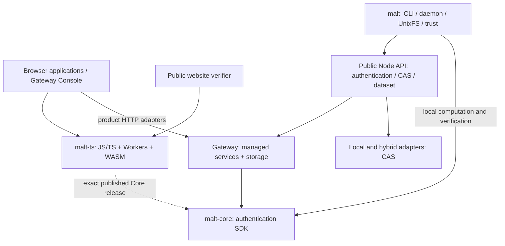

# DeWebProtocol

**User-owned, verifiable data infrastructure for the AI era.**

DeWebProtocol builds infrastructure for Personal Online Datastores: data stores
that users can hold, move, verify, and authorize across applications and storage
providers. Our goal is an open data layer where applications can use
user-controlled objects without making one platform database the permanent
authority for data integrity or structure.

## MALT

MALT combines an application-neutral authentication SDK, a user-controlled local
runtime, browser tooling, and managed storage services. Core turns structured
data into a compact Root. Clients select that Root and a query, obtain evidence
from an untrusted executor, and verify the answer locally. Applications also
check returned content bytes against their authenticated CIDs.

Authentication, storage, and trust policy have separate owners. Core defines
what a Root and its evidence mean; applications select trusted Roots; services
store data and enforce access policy. A successful service response does not
automatically change a client's accepted Root.

## Repositories

| Repository | Responsibility |
| --- | --- |
| [`malt-core`](https://github.com/DeWebProtocol/malt-core) | Go authentication and Object SDKs; normative protocol, Root/CID rules, proofs, schemas, MIPs, and conformance |
| [`malt-ts`](https://github.com/DeWebProtocol/malt-ts) | Supported JavaScript/TypeScript API, browser Workers, reproducible verifier/writer WASM assets, and package integration |
| [`malt`](https://github.com/DeWebProtocol/malt) | Local runtime, CLI/daemon, accepted/candidate Roots, UnixFS, synchronization, and the public Node API |
| [`gateway`](https://github.com/DeWebProtocol/gateway) — private | Managed accounts and Buckets, authorization, persistence, root publication, Console, deployment, and product E2E |
| [`malt-evaluation`](https://github.com/DeWebProtocol/malt-evaluation) — private | Reproducible experiments, plans, comparison adapters, raw artifacts, analysis, and result provenance |
| [`malt-web`](https://github.com/DeWebProtocol/malt-web) | Public website, conceptual documentation, tutorials, and verification tools |

Private repository links require access. For repository-routing questions, use
the [support guide](https://github.com/DeWebProtocol/.github/blob/main/SUPPORT.md).

## Architecture

```mermaid
flowchart TD
  browser["Browser applications / Gateway Console"] --> sdk["malt-ts: JS/TS + Workers + WASM"]
  web["Public website verifier"] --> sdk
  browser -->|product HTTP adapters| gateway["Gateway: managed services + storage"]
  native["malt: CLI / daemon / UnixFS / trust"] --> api["Public Node API: authentication / CAS / dataset"]
  api --> gateway
  api --> local["Local and hybrid adapters: CAS"]
  gateway --> core["malt-core: authentication SDK"]
  native -->|local computation and verification| core
  sdk -. exact published Core release .-> core
```

### Core and browser SDKs

Core authenticates label-to-CID bindings using coordinate derivation,
Prefix/Positional layouts, and KZG or IPA commitment profiles. It provides typed
queries, local verification, immutable retained writers, complete candidates,
and ordered candidate batches. Storage is supplied through narrow injected
capabilities; persistent ArcTable, KV, CAS, HTTP, and application policy belong
to callers.

The optional Go [Object SDK](https://github.com/DeWebProtocol/malt-core/blob/main/docs/guides/objects.md)
adds Maps, Lists, immutable content, and custom structs. Recursive `Commit`
visits child objects before parents; `Delta` describes changes between local
committed graphs. These local operations do not publish or accept a remote Root.

`malt-ts` owns the browser API, Worker lifecycle, WASM builds, and asset
distribution. Its assets bind an exact published Core tag, commit, and module
checksums. Core remains the authority for authentication semantics. Gateway
accounts, Bucket APIs, and application cache policy belong to product code.

### Local runtime and public Node API

The runtime owns local trust policy, CLI/daemon services, encrypted UnixFS
backup and restore, synchronization, and verified filesystem reads. Linux FUSE
mounts are read-only by default; explicit write-back stages changes and computes
candidates without accepting them automatically. UnixFS supports `flat-v1`,
`hybrid-v1`, and `rooted-v1` application layouts. IPFS-compatible Merkle DAG
import is a separate capability whose output is a DAG CID.

The [public Node API](https://github.com/DeWebProtocol/malt/blob/main/docs/node-api.md)
defines transport-independent authentication, CAS, and dataset-branch
capabilities. Gateway services and their HTTP adapters share these contracts;
local and hybrid adapters currently implement CAS. Local-only CAS supports
Merkle DAG import. Native MALT backup, mount, and write-back still require
Gateway or hybrid capabilities; a complete autonomous local authentication
store remains future work.

Use a pinned runtime commit for current APIs. The historical `v0.0.1` tag
predates the repository rename and current staging/write-back interfaces. The
Go module name remains `github.com/dewebprotocol/malt-client`.

### Managed Gateway

Gateway owns persistence, managed accounts and Bucket membership, quota,
authentication services, candidate materialization, and branch publication.
Its shared services apply authorization and lifecycle checks to both HTTP and
in-process callers. Native MALT, immutable CAS, and Merkle DAG compatibility
remain separate capabilities. `gateway/console` owns the managed account and
Bucket UI and packages its frontend separately from the Go service.

Bucket permissions are implemented. Complete shared-snapshot, browser-cache,
and public-CID revocation remains a separate product limitation: changing a
grant cannot recall bytes already downloaded. The managed service remains a
single-node Alpha; multi-instance coordination and broader production
hardening remain open.

## Reads, writes, and trust

1. Select a trusted Root and an exact typed query before requesting evidence.
2. Verify the response locally, then bind any content bytes to the verified CIDs.
3. Compute a candidate locally and transfer its complete state or an ordered
   batch; check that the materialization receipt matches the intended batch.
4. Treat publication, observed heads, and local Root acceptance as separate
   operations governed by the application.

Candidate deltas and materialization receipts are not portable state-transition
proofs. They do not establish freshness, authorization, publication, or local
trust. The [Core contracts](https://github.com/DeWebProtocol/malt-core/blob/main/docs/spec/README.md)
and [runtime Node API](https://github.com/DeWebProtocol/malt/blob/main/docs/node-api.md)
define the current executable boundaries.

## Release and source status

The following snapshot was checked on **2026-10-06**. Release tags, source
dependencies, packaged assets, and deployed services are separate facts.

| Component | Inspected binding |
| --- | --- |
| Core | Latest published prerelease: [`v0.0.10-rc.3`](https://github.com/DeWebProtocol/malt-core/releases/tag/v0.0.10-rc.3) |
| TypeScript SDK | Source version `0.0.3-rc.3`; [Core lock](https://github.com/DeWebProtocol/malt-ts/blob/21d438d47045178c23844c76cef1ee6b2b75964c/malt-core.lock.json) binds published Core rc.3 |
| Runtime and Gateway | [Runtime](https://github.com/DeWebProtocol/malt/blob/44bd537d50bb49e74c0a01d274890e9af43de3a0/go.mod) and [Gateway](https://github.com/DeWebProtocol/gateway/blob/c059bea7a179e3c1f7f7ae740d6fb1d50a63cc59/go.mod) source dependencies pin Core rc.3 |
| Public website verifier | [Checked-in asset lock](https://github.com/DeWebProtocol/malt-web/blob/a4d28d85d3c6aa49acdff59837bc0aed7c20d3fd/verifier-source.json) binds SDK `0.0.3-rc.3` and Core `v0.0.10-rc.3`, matching Console's SDK source pin |

A browser verifier's compatibility follows its packaged assets, provenance,
and checksums. Updating Core or a dependency manifest does not update an
already built verifier or deploy a service. MALT remains experimental; consult
the owning repository's release and compatibility documentation before use.

## Evaluation

The active evaluator is `cmd/malt-eval-next`. It runs explicit experiments,
records raw observations with immutable source and binary identities, and
reconstructs analyses from validated artifacts. Core-only measurements and
runtime/Gateway product measurements have distinct boundaries.

The [implementation matrix](https://github.com/DeWebProtocol/malt-evaluation/blob/main/docs/evaluation-next-implementation.md)
separates delivered infrastructure from outstanding product workers, formal
campaigns, paper claims, and independent reproduction. Merged code or a smoke
run does not establish publication-quality results. Retained RQ executors and
historical artifacts keep their original experiment identities.

## Documentation and community

- [Core architecture](https://github.com/DeWebProtocol/malt-core/blob/main/ARCHITECTURE.md)
  and [specifications](https://github.com/DeWebProtocol/malt-core/blob/main/docs/spec/README.md)
- [TypeScript/browser usage](https://github.com/DeWebProtocol/malt-ts#readme)
- [Local runtime Go API](https://github.com/DeWebProtocol/malt/blob/main/docs/go-api.md)
- [Public website and tutorials](https://dewebprotocol.github.io/malt-web/)
- [Contributing](https://github.com/DeWebProtocol/.github/blob/main/CONTRIBUTING.md)
  and [support](https://github.com/DeWebProtocol/.github/blob/main/SUPPORT.md)

Report security issues privately using
[SECURITY.md](https://github.com/DeWebProtocol/.github/blob/main/SECURITY.md).
